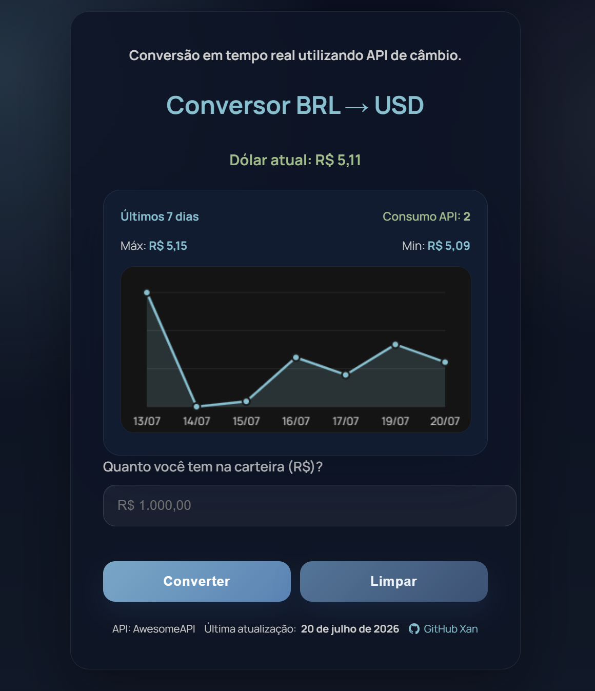

# Conversor de Moedas — BRL → USD

  

  Uma aplicação web responsiva para conversão de Real Brasileiro (BRL) para Dólar Americano (USD), utilizando cotação atualizada através de uma API externa.

  <a href="https://xampsdev.github.io/conversor-de-moedas/">
    Acessar projeto
  </a>

---

## Sobre o projeto

Este projeto foi desenvolvido para praticar e aplicar conceitos de desenvolvimento Front-End, com foco em consumo de API, manipulação do DOM e criação de uma interface simples, responsiva e funcional.

A aplicação consulta a cotação atual do dólar e calcula quanto um determinado valor em reais representa em dólares americanos.

---

## Funcionalidades

- Conversão de BRL para USD
- Consulta da cotação atual do dólar através de API
- Validação do valor inserido pelo usuário
- Tratamento de entradas inválidas
- Feedback visual para diferentes estados da aplicação
- Interface responsiva para diferentes tamanhos de tela
- Microinterações com hover, foco e transições
- Atualização dinâmica do conteúdo através da manipulação do DOM

---

## Tecnologias utilizadas

- HTML5
- CSS3
- JavaScript
- Fetch API
- API REST
- JSON
- Git
- GitHub

---

## API

Os dados da cotação são obtidos através da [AwesomeAPI](https://docs.awesomeapi.com.br/api-de-moedas).

---

## Conceitos praticados

- Consumo de APIs externas
- Requisições assíncronas com `fetch()`
- Manipulação do DOM
- Validação de dados
- Tratamento de erros
- Responsividade
- UI/UX
- Organização de código

---

## Acessar o projeto

🔗 [Conversor de Moedas — BRL → USD](https://xampsdev.github.io/conversor-de-moedas/)

---

## Autor

Desenvolvido por **XAN**

- GitHub: [@xampsdev](https://github.com/xampsdev)
